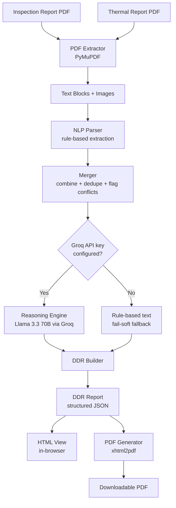

# Urbanroof Assignment — AI-Generated Detailed Diagnostic Report (DDR) System

An AI workflow that reads a property **Inspection Report** and a **Thermal Survey Report** (both PDFs) and generates a structured, client-ready **Detailed Diagnostic Report (DDR)** — combining textual observations and embedded images from both source documents into one coherent report, available as both an in-browser view and a downloadable PDF.

Built for the AI Generalist / Applied AI Builder practical assignment.

---

## Table of Contents

- [Quick Start (for the invigilator)](#quick-start-for-the-invigilator)
- [Architecture & Workflow](#architecture--workflow)
- [Tech Stack](#tech-stack)
- [Key Design Decisions](#key-design-decisions)
- [Project Structure](#project-structure)
- [Known Limitations](#known-limitations)

---

## Quick Start (for the invigilator)

### Prerequisites
- Python 3.10+
- Node.js 18+
- (Optional, for AI-enhanced reasoning) A free [Groq](https://console.groq.com) API key — no credit card required

### 1. Clone the repository

```bash
git clone https://github.com/YOUR_USERNAME/Urbanroof-Assignment.git
cd Urbanroof-Assignment
```

### 2. Backend setup

```bash
cd backend
python -m venv venv

# Activate the virtual environment
source venv/bin/activate        # macOS/Linux
venv\Scripts\activate           # Windows

pip install -r requirements.txt
```

Create a `.env` file inside `backend/` (this is git-ignored and never committed):

```
GROQ_API_KEY=your_groq_api_key_here
GROQ_MODEL=llama-3.3-70b-versatile
```

> **Note:** the system works without a Groq key too — it will fall back to clear, rule-based report text instead of LLM-enhanced phrasing. See [Key Design Decisions](#key-design-decisions) below.

Start the backend:

```bash
uvicorn app.main:app --reload --port 8000
```

Confirm it's running by visiting `http://127.0.0.1:8000/api/health` — you should see `{"status":"ok"}`.

### 3. Frontend setup

In a **second terminal**:

```bash
cd frontend
npm install
npm run dev
```

Open `http://localhost:5173` in your browser.

### 4. Test it

Use the sample documents included in this repository at `backend/tests/sample_data/`:
- `Sample_Report.pdf` — the inspection report
- `Thermal_Images.pdf` — the thermal survey report

Upload each into its respective channel in the UI, click **Generate DDR**, and the structured report will render in-browser with an option to **Download PDF**.

---

## Architecture & Workflow



**Pipeline stages:**

1. **Extraction** (`pdf_extractor.py`) — Pulls text and embedded images from each PDF using PyMuPDF. Images are filtered by minimum dimension and verified against their actual on-page placement rectangles, to exclude UI icons/template assets and avoid the duplicate-image artifacts common in PDFs exported from form-builder tools.
2. **Parsing** (`nlp_extractor.py`) — Rule-based regex parsing extracts room-level findings from the inspection report (negative/positive side descriptions) and structured temperature readings from the thermal report.
3. **Merging** (`merger.py`) — Groups findings by room, applies conservative keyword-based severity classification, and matches images to areas by text proximity. Honestly flags any data that can't be confidently merged (see below).
4. **Reasoning** (`reasoning_engine.py`) — Optionally calls Groq's hosted Llama 3.3 70B model to rewrite the rule-based text in clearer, more natural client-facing language, under a strict system prompt forbidding invented facts. Fails soft to the rule-based text if the API is unreachable.
5. **Report Building** (`ddr_builder.py`) — Assembles the final 7-section DDR structure, including the explicit "Missing or Unclear Information" section.
6. **Rendering** (`pdf_generator.py`) — Renders the same Jinja2 template to both an HTML string (for the in-browser view) and a PDF (via `xhtml2pdf`, for download).

---

## Tech Stack

| Layer | Choice | Why |
|---|---|---|
| Frontend | React (Vite) | Fast dev server, no SSR overhead needed for a single-page tool |
| Backend | FastAPI | Async support, automatic request validation, built-in `/docs` API explorer |
| PDF parsing | PyMuPDF (`fitz`) | Reliable text + image extraction with page-level placement data |
| Structured extraction | Rule-based regex parsing | Source documents follow a consistent, predictable layout; deterministic parsing avoids hallucination risk entirely for factual extraction |
| Reasoning / phrasing | Llama 3.3 70B via Groq API | Free tier, no credit card, no idle hosting cost (pay-per-use is effectively free at this scale), strong enough for rephrasing/summarizing — see reasoning below |
| PDF generation | `xhtml2pdf` | Pure Python, zero system-level dependencies (unlike WeasyPrint, which requires GTK/Pango/Cairo and is notoriously fragile to install on Windows) |
| Templating | Jinja2 | Single template shared between HTML view and PDF output, keeping both visually consistent |

### Why not a Hugging Face extraction model?

The original plan considered a Hugging Face model (e.g. NuExtract, purpose-built for schema-based structured extraction) for the extraction step. After testing against the real sample documents, deterministic rule-based parsing proved more reliable for this specific, consistently-formatted form layout, with zero hallucination risk and zero inference cost. The system is still genuinely AI-powered — Llama 3.3 70B (via Groq) handles the interpretive reasoning (root cause synthesis, severity justification, client-friendly rephrasing) that benefits from a real language model, while the factual extraction stays deterministic and auditable. This split — deterministic extraction, LLM reasoning — directly serves the assignment's "do not invent facts" requirement.

---

## Key Design Decisions

### 1. Honest handling of the thermal/area mapping gap

The sample Thermal Report contains 30 temperature readings with images, but **no room or area labels** — only sequential filenames. The Inspection Report, in contrast, explicitly names rooms (Hall, Kitchen, Master Bedroom, etc.).

Rather than guessing a mapping (by sequence order, or by asking an LLM to visually infer a room from an abstract thermal heatmap — which has no distinguishing visual features), this system:
- Builds area-wise observations entirely from the Inspection Report, since it explicitly names rooms.
- Reports thermal findings as a separate "Thermal Survey Findings" block, explicitly labeled as not mapped to a specific area.
- States this exact limitation in the "Missing or Unclear Information" section.
- Still extracts real signal from the thermal data (flags statistically high readings) without inventing a room location for them.

This was a deliberate choice to satisfy the assignment's explicit instruction: *"Do NOT invent facts not present in the documents... if information is missing → write 'Not Available'."*

### 2. Fail-soft LLM integration

If the Groq API is unreachable, rate-limited, or no API key is configured, the system falls back to the original rule-based text rather than crashing — reliability was treated as a first-class requirement, not an afterthought.

### 3. Cross-reference detection

The sample inspection report contains one finding referencing a different flat ("Flat no 203"), which appears to be a comparison point rather than part of the inspected property. This is detected and excluded from area-wise observations (to avoid misattributing it to the subject property) but is still surfaced in "Missing or Unclear Information" rather than silently dropped.

### 4. Free, zero-card-required hosting path

Model selection was driven by realistic deployment cost: the reasoning model runs via Groq's free tier (no credit card, generous rate limits), with zero idle cost when the system isn't actively generating a report. PDF generation uses a pure-Python library specifically to avoid the system-dependency installation problems that block deployment on constrained or free-tier hosting environments.

---

## Project Structure

```
Urbanroof-Assignment/
├── backend/
│   ├── app/
│   │   ├── main.py              # FastAPI entrypoint
│   │   ├── config.py            # environment-based settings
│   │   ├── api/routes.py        # /api/generate-ddr, /api/download-pdf
│   │   ├── core/
│   │   │   ├── pdf_extractor.py
│   │   │   ├── nlp_extractor.py
│   │   │   ├── merger.py
│   │   │   ├── reasoning_engine.py
│   │   │   ├── ddr_builder.py
│   │   │   └── pdf_generator.py
│   │   ├── models/schemas.py    # Pydantic DDR schema
│   │   └── templates/ddr_report.html
│   ├── tests/sample_data/       # sample PDFs used for testing
│   └── requirements.txt
├── frontend/
│   └── src/
│       ├── App.jsx
│       ├── components/
│       └── api/client.js
└── README.md
```

---

## Known Limitations

- **Image-to-area matching** uses a simple text-proximity heuristic (matching an image's nearby page text against the area name). It works well for clearly-labeled sections but can miss matches when a photo's surrounding text doesn't explicitly name the room — these cases are explicitly disclosed in the report's "Missing or Unclear Information" section rather than silently failing.
- **Rule-based parsing** is tuned to the layout of the provided sample inspection form (UrbanRoof-style) and the Bosch thermal camera export format. A differently-formatted inspection report (different field labels, layout) would need either an updated regex pattern set or a fallback ML extraction step.
- **In-memory report cache**: generated reports are held in server memory, not a database. Restarting the backend clears previously generated reports (PDF re-download will fail for reports generated before a restart). This is appropriate for a demo/assignment deployment; production use would persist reports to a database.
- **Severity classification** is keyword-based (e.g. "crack," "leakage" → High; "dampness," "hollowness" → Medium), which is conservative and explainable but not a substitute for an inspector's professional judgment.

### How this would be improved with more time
- Smarter image-to-area matching (e.g. embedding-based visual similarity, or layout-aware extraction that anchors images to their exact preceding heading)
- A persistent database for report storage instead of in-memory caching
- Support for additional inspection report layouts via a configurable parsing schema
- Automated tests covering the parsing regex against a wider variety of sample documents
